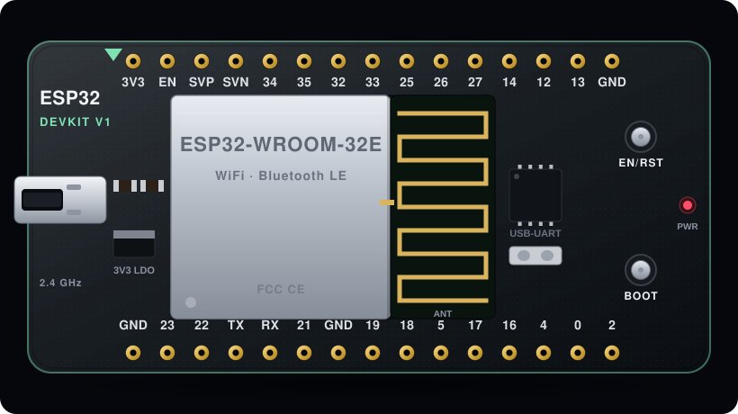

<p align="center">
  
</p>

<div align="center">

# 📚 WIKI — WiFi Repeater

**Complete reference · flashing · usage · API · troubleshooting**


</div>

---

## 📖 Contents

1. [Product overview](#1-product-overview)
2. [Bill of materials](#2-bill-of-materials)
3. [Flashing in detail](#3-flashing-in-detail)
4. [First boot & connection](#4-first-boot--connection)
5. [Panel / usage guide](#5-panel--usage-guide)
6. [Access credentials](#6-access-credentials)
6.1 [Web API reference](#61-web-api-reference)

7. [Serial console](#7-serial-console)
8. [Default settings](#8-default-settings)
9. [Firmware file reference](#9-firmware-file-reference)
10. [Troubleshooting & FAQ](#10-troubleshooting--faq)
11. [Safety, law & ethics](#11-safety-law--ethics)

---

## 1. Product overview

A production-grade **NAT-based WiFi range extender**. The ESP32 holds a **STA** link to your router and simultaneously runs a **softAP** for clients; lwIP's `CONFIG_LWIP_IPV4_NAPT` forwards traffic between them. The configuration panel is behind **HTTP Basic Auth**, never echoes stored passwords back to the browser, HTML-escapes every field and validates input lengths. Uplink reconnects use **exponential back-off**, NAPT re-arms itself after every reconnect, and all settings live in **Preferences (NVS)**.

**Use cases**

- 📶 **Dead-zone killer** — bring WiFi to a balcony, garage or workshop
- 🏠 **Guest network** bridged to your main router
- 🔌 **IoT uplink** for printers / cameras that live out of range
- 🎓 **Networking lab** — watch IPv4 NAT (NAPT) working in lwIP

---

## 2. Bill of materials

<p align="center">
  
</p>

| # | Item | Notes |
|:--|:--|:--|
| 1 | **ESP32 Dev Module** | ESP32 · Xtensa dual-core 240 MHz · WiFi + BLE — the board shown on the main page |
| 2 | USB cable (data-capable) | charge-only cables will not flash |
| 3 | 5 V / 1 A power supply | phone charger is fine |
| 4 | A phone or laptop | to open the control panel |

No sensors, no breadboard, no soldering.

---

## 3. Flashing in detail

### 3.1 Files and offsets

| File | Offset | What it contains |
|:--|:--|:--|
| `WiFiRepeater-full.bin` | `0x0` | complete flash image (bootloader + partition table + app) |
| `WiFiRepeater-app.bin` | `0x10000` | application only |
| `WiFiRepeater-bootloader.bin` | `0x1000` | 2nd-stage bootloader |
| `WiFiRepeater-partitions.bin` | `0x8000` | partition table |
| `WiFiRepeater-ota.bin` | `0xE000` | OTA select data (usually optional) |

### 3.2 Recommended: single merged image

The `*-full.bin` image already contains bootloader + partition table + application. One file, one offset:

```bash
esptool.py --chip esp32 --port /dev/ttyUSB0 --before default_reset --after hard_reset \
  write_flash 0x0 firmware/WiFiRepeater-full.bin
```

### 3.3 Web flasher

Open [espressif.github.io/esptool-js](https://espressif.github.io/esptool-js/) → **CONNECT** → add the files/offsets from §3.1 → **ERASE FLASH** → **START**.

### 3.4 If flashing fails

| Symptom | Fix |
|:--|:--|
| `Failed to connect to ESP32: No serial data received` | Hold **BOOT**, click START, release after ~2 s |
| `Invalid head of magic byte` | Wrong offset — check §3.1 again |
| `A fatal error occurred: Wrong boot mode` | Erase flash first, then re-flash |
| Port not listed | Try another cable/port; install the CP2102/CH340 driver |
| Board boots but panel not visible | Erase flash, flash the **full** image again |

---

## 4. First boot & connection

1. Power the board and wait ~5 seconds.
2. On your phone, open **Wi-Fi settings** and look for **`ESP_Repeater`**.
3. Join it (password **`repeater123`**).
4. Open **`http://192.168.4.1 (or http://repeater.local)`** in a browser.
5. The control panel is now live — no internet needed on the ESP side.

---

## 5. Panel / usage guide

1. Flash, power on, then join **`ESP_Repeater`** — password **`repeater123`**.
2. Open **`http://192.168.4.1`** (or **`http://repeater.local`**) and log in — default **`admin` / `admin`**.
3. Fill in **your router's SSID + password**; optionally rename the repeater AP (type `none` for open).
4. Press **Save & Reboot** — input is validated, stored in NVS and the board restarts.
5. Join the **new repeater network** — internet now works through it (NAPT).
6. Monitor it with `GET /api/status` (JSON) or the LED (solid = link up).
7. Clean slate? Serial `reset`, or **hold BOOT 5 seconds** for a factory reset.

**Everything the panel does is also reachable from the serial console at 115200 baud.**

---

## 6. Access credentials

| Item | Value |
|:--|:--|
| 📶 **AP SSID** | `ESP_Repeater` |
| 🔑 **AP password** | `repeater123` |
| 🌍 **Panel URL** | `http://192.168.4.1 (or http://repeater.local)` |
| 🖥️ **Control IP** | `192.168.4.1` |
| 🔐 Panel login | `admin / admin — change it on the panel` |
| 🔑 Factory reset | `hold BOOT 5 s — or serial reset` |

> 💡 To change these, flash a build configured for your own credentials or use the serial console (see §7).


### 6.1 Web API reference

All endpoints are plain `GET` on the panel host:

| Endpoint | Effect |
|:--|:--|
| ``/`` | Configuration form — **HTTP Basic Auth required** |
| ``/save`` | Validate + persist to NVS, then reboot (password never in the URL) |
| ``/api/status`` | JSON: uptime, STA/RSSI, clients, NAPT, heap, version (open) |

```bash
# poll status
curl "http://192.168.4.1/api/status"
```

---

## 7. Serial console

```
Port settings: 115200 baud, 8N1, no flow control
Repeater console — type HELP
```

| Command | Action |
|:--|:--|
| ``ssid <name>`` | Uplink router SSID |
| ``pass <name>`` | Uplink router password |
| ``apssid <name>`` | Repeater AP name |
| ``appass <name>`` | Repeater AP password (`none` = open) |
| ``user <name>`` | Web login user |
| ``hpass <name>`` | Web login password |
| ``show` / `status`` | Config + live status |
| ``version`` | Print firmware version |
| ``save`` | Commit to flash |
| ``reset`` | Factory reset |
| ``reboot`` | Restart the ESP32 |

**Typical session**

```text
115200 baud
Repeater console — type HELP
> `ssid <name>`
> `pass <name>`
> `apssid <name>`
> `appass <name>`
> `user <name>`
> `hpass <name>`
```

---

## 8. Default settings

| Setting | Default | Changeable at runtime |
|:--|:--|:--|
| WiFi network (AP) | `ESP_Repeater` | flash-time build setting |
| AP password | `repeater123` | flash-time build setting |
| Panel address | `192.168.4.1` | fixed |
| Serial baud | `115200` | fixed |
| Region/channel | auto (1–13) | follows the target |

---

## 9. Firmware file reference

> ⏳ Binaries ship with the release — verify them against the SHA-256 below.

| File | Size | SHA-256 |
|:--|:--|:--|
| `WiFiRepeater-full.bin` | 4.0 MB | `b7ba0493eba96844` |
| `WiFiRepeater-app.bin` | 967.7 KB | `5563bff34c890211` |
| `WiFiRepeater-bootloader.bin` | 22.9 KB | `7c5e6c42dcd3b658` |
| `WiFiRepeater-partitions.bin` | 3.0 KB | `aaae2888c5a6a348` |
| `WiFiRepeater-ota.bin` | 8.0 KB | `f94c5d786a7a8fab` |

Copy a checksum to verify your download:

```bash
sha256sum firmware/*
```

---

## 10. Troubleshooting & FAQ

**❓ The AP does not show up in my WiFi list**
Re-flash the **full** image, power-cycle, and wait ~10 s. 2.4 GHz only — many phones hide it if you are on 5 GHz-only.

**❓ I joined the AP but the panel will not open**
Type the address manually: `http://192.168.4.1 (or http://repeater.local)`. Disable mobile data (Android) and any VPN.

**❓ The panel loads but every action fails**
The ESP32/ESP8266 has a single radio: while scanning or attacking, the panel can stall for a second or two. Wait and retry.

**❓ Serial monitor shows garbage**
Set the baud rate to **115200**.

**❓ Do I need the source code?**
No. Everything is controlled from the web panel / serial console using the pre-built `.bin`.

**❓ How do I factory-reset?**
Re-flash the **full** image (erases NVS/EEPROM), or use `reset` on the serial console.

**❓ Which devices does it support?**
Anything on 2.4 GHz WiFi that joins your network or is visible in a scan — phones, laptops, TVs, IoT gadgets.

---

## 11. Safety, law & ethics

> ⚠️ **Educational / authorized testing only.** Run this firmware **only** on hardware and networks **you own or have explicit written permission to test**. Unauthorized jamming, deauthentication, evil-twin phishing or traffic interception is **illegal** in most jurisdictions. You are solely responsible for how you use this code.

**Allowed** · your own lab · your own router · a client's written authorisation · classroom demos with consent.
**Not allowed** · a café, airport, neighbour or any network you do not own.

---

<div align="center">


**WiFi Repeater · Wiki · © 2026**

</div>
